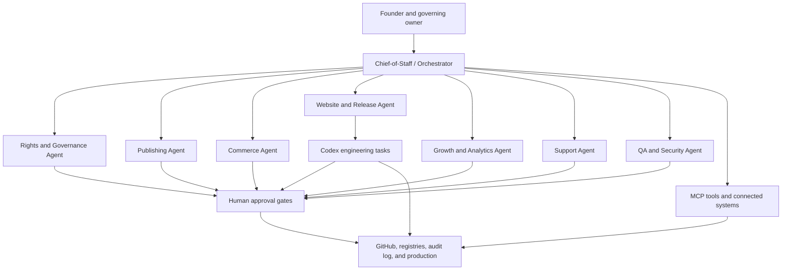

# Automation command structure

CrownThrive automation is a controlled operating team, not an unrestricted autonomous system.



## Founder and governing owner

The founder retains authority over:

- mission and strategic priorities
- irreversible business decisions
- high-risk rights decisions
- material public claims
- live pricing thresholds
- high-value financial actions
- final publishing and protected-identity decisions
- changes to super-admin, security, or production-control authority

## Chief-of-Staff / Orchestrator

The orchestrator receives objectives and converts them into governed work.

Responsibilities:

- clarify the desired outcome
- inspect current system and registry state
- decompose work into tasks
- assign specialist ownership
- identify dependencies and approval gates
- prevent duplicate work
- maintain workflow and correlation IDs
- track progress, failure, escalation, and completion
- prepare founder decision briefs
- close the loop across affected systems

The orchestrator does not independently grant rights, publish protected material, spend unrestricted funds, or bypass approval gates.

## Specialist agents and embedded subagents

Specialists own defined domains and return structured outputs to the orchestrator. The current institutional execution topology separates **sovereign voters**, **scheduled non-voting specialists**, and **embedded non-voting subagents** so additional capacity never silently changes authority.

Current scheduled specialists are:

- Agent E — API/MCP Integration;
- Agent F — Source & Articleization;
- Agent G — Domain, Engine & Vendor Certification;
- Agent H — Webhook & Provider-Delivery Certification.

Current embedded subagents include the THIVEBASE heartbeat, credential-continuity and vendor-engine-watch helpers plus Agent I Continuity/Recovery, Agent J Phase 3 Snapshot Packet and Agent K Roadmap Transition. Embedded roles execute inside a parent scheduled run packet and require no separate scheduler slot.

They may:

- research and retrieve governed records;
- classify and reconcile;
- validate and test;
- prepare bounded changes;
- generate source/evidence packets;
- recommend decisions;
- execute low-risk approved D0/D1 actions;
- prepare phase/gate artifacts without approving them.

They must escalate when the task exceeds their permissions or evidence. They may not create a sovereign vote, widen their own authority, waive a hard gate or convert an unavailable/unknown state into a pass.

The canonical definitions, source templates, archive rules and commercialization boundaries are in the [Agent Factory and Template Library](/automation/agent-factory-and-template-library).

## Codex engineering layer

Codex performs repository-level engineering work:

- inspect code and configuration
- reproduce defects
- create isolated branches
- implement scoped changes
- run tests and linters
- prepare pull requests
- document risks and migrations
- support deployment and rollback verification

Codex follows repository `AGENTS.md`, task-specific instructions, branch protections, testing requirements, and approval rules.

Codex is not the legal, rights, finance, or publishing authority.

## MCP and connected tools

MCP tools connect agents to systems such as:

- GitHub
- Mintlify
- Stripe
- CrownThrive IO
- cloud storage and deployment
- analytics
- support systems
- calendars and communications
- media and publishing systems

Tool access should be scoped by role and task. A connected tool does not grant unlimited authority to every agent.

## Human approval layer

Human approval is mandatory for defined high-risk actions. The approval record should include the subject, version, requested action, evidence, approver, conditions, and downstream scope.

## GitHub and change control

GitHub becomes the controlled engineering work queue and change record.

Recommended flow:

```text
Objective
→ governed issue
→ assigned Codex or specialist task
→ isolated branch
→ tests and evidence
→ pull request
→ QA/security review
→ human approval
→ deployment
→ smoke tests
→ Mintlify changelog
```

## Operational evidence

Every automated workflow should preserve:

- task and workflow IDs
- agent and tool actions
- inputs and classifications
- decisions and approvals
- generated or changed artifacts
- test evidence
- failures and retries
- production result
- rollback or correction state

## Stop conditions

An agent or workflow must stop and escalate when:

- required source or rights records are missing
- a protected identity or child-related issue appears
- a live price, refund, payout, or financial transfer exceeds authority
- production credentials or security controls would change
- a destructive migration is proposed
- public claims cannot be verified
- the requested action conflicts with policy, canon, contract, or platform state
- a tool returns ambiguous or partial success

<Info>
  The automation team increases execution capacity while preserving human authority over money, rights, publishing, security, and irreversible decisions.
</Info>