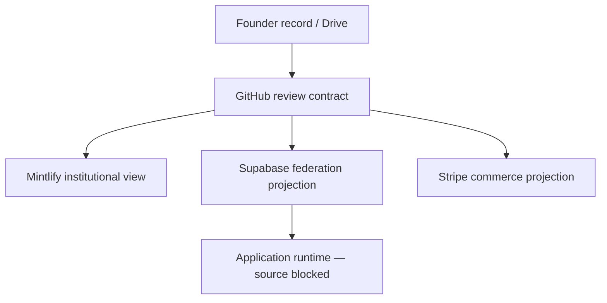

# Sermon Toolkit Final Directive Control Plane

This page records a **reviewable, non-activating Phase 2.99 seed**. It converts the final founder directive into one machine-validated contract across the founder record, GitHub, Mintlify, Supabase projections, Stripe projections, sibling-agent roles, schedules, evidence gates, and rollback boundaries.

It does **not** certify the application, catalog, checkout, fulfillment, integrations, schedules, articles, memberships, or 30 product families as live.

- **Stable directive ID:** `ct.manifest.kjv-sermon.final-directive-control-plane.v1`
- **Branch origin:** `main@8fcb68bf209e32ba2cd265e1b6ca730cb8da64d7`
- **Current PR base:** `main@4bada510f8cc8b482ae9715180aa44aec552c077`
- **Review branch:** `admin-mcp/sermon-toolkit-final-directive-control-plane-8fcb68b`
- **Operating timezone:** `America/New_York`
- **Documentation impact:** `docs_delta_opened`
- **Production activation:** disabled
- **Final release certification:** blocked
- **Founder record:** [CrownThrive Sermon Toolkit master directive](https://docs.google.com/document/d/1z2exswOKIP_2YLTJWtDegC6C9gR5yayen7G-9AlM8tQ)

## Cross-layer architecture

| Layer | Responsibility | Current state | Activation boundary |
| --- | --- | --- | --- |
| Founder / Google Drive | Human-readable authority, exceptions, approval record | Native master created and verified | Document existence does not authorize runtime writes |
| GitHub | Manifest, JSON Schema, validator, CI, review history | Additive review branch | No merge or deployment in this packet |
| Mintlify | Institutional explanation and changelog | Hidden and `noindex` review pages | Shared navigation and registers deferred |
| Supabase / THRIVEBASE | Identity, RLS, registry, federation, future queue and scheduler | Read-oriented evidence only | No direct database writes or public certification |
| Stripe | Products, Prices, Checkout, Billing, Portal, Tax, webhook contract | Live inventory read; observer exists | No catalog mutation or fulfillment claim |
| Application repositories | Public routes, products, files, fulfillment, member UX | Editable source not connected or recovered | Exact source and patch checkpoint required |

## Non-negotiable business rules

- The business model is digital-only.
- Every applicable commerce and fulfillment surface must state: **DIGITAL PRODUCT ONLY. NO PHYSICAL ITEM WILL BE SHIPPED.**
- CrownThrive does not print, manufacture, stock, warehouse, ship, or replace physical goods.
- Customers may manufacture licensed physical end products only within the purchased rights, territory, term, and unit cap.
- No source-file redistribution, sublicense, template-link resale, model training, or fabricated compatibility claim.
- Product families, articles, memberships, prices, schedules, provider connections, and release states remain inactive until their evidence gates pass.
- AdLuxe Zone `108420` is a verified display placement only. It is not a VAST zone.
- A managed Canva connector does not prove the product application's OAuth connection.

## Current verified truth

### Public surfaces

- KJV Visualized has a substantial public server-rendered surface and sitemap, but observed checkout controls remain disabled or configuration-checking and do not prove payment, fulfillment, entitlements, rights IDs, or downloads.
- The Sermon Toolkit root still redirects to a thin `/guest` shell. Meaningful public discovery remains a release blocker.
- The default Mintlify deployment is anonymous-auth gated. A custom public documentation domain is deferred.
- Virality Music demonstrates finished-file and catalog evidence separately from checkout activation. Zone `108420` remains display-only evidence.

### Supabase and MCP

- The project is healthy with 53 custom tables; all 53 use RLS and the current security-advisor audit returned zero lints.
- No KJV/Sermon tables currently model product families, editions, files, orders, licenses, rights, entitlements, downloads, refunds, or disputes.
- `pgmq` is available but not installed. The requested durable queue and dead-letter behavior do not exist.
- Seven existing cron jobs do not implement the requested Sanctuary article, product, or compatibility schedules.
- The current institutional Stripe webhook receiver is an observer. Its receipts table has zero rows and it does not implement fulfillment.

### Stripe

| Metric | Observed value | Release meaning |
| --- | ---: | --- |
| Products | 395 total; 373 active | Account-wide inventory, not a Sermon Toolkit catalog |
| Prices | 391 total; 372 active | No canonical family / edition / license mapping |
| Subscriptions | 4 total; 1 active | The active subscription is not a Sermon Toolkit membership |
| Portal | 1 active default configuration | Self-service exists; platform terms links remain incomplete |
| Tax | 1 active Virginia registration | Product tax-code and legal/tax review still required |
| KJV/Sermon matches | 0 actual products | The 30 families and memberships do not exist in Stripe |
| Institutional receipts | 0 | Webhook registration is not fulfillment proof |

The inventory also contains six active shippable physical Virality products, 145 Products without a default Price, eight active Products without any Price, three active Prices attached to inactive Products, 66 public names with version/revision tokens, 391 Products without tax codes, 389 Prices with unspecified tax behavior, and 358 Prices without lookup keys. Remediation must be owner-mapped, reversible, and separate from this directive seed.

## Sibling-agent contract

The existing `ct.agent.kjv-room-release` remains the non-voting domain orchestrator. Planned specialists cover patch reconciliation, source recovery, public-route SEO and accessibility, catalog/edition reconciliation, product production, compatibility, rights, Stripe commerce, fulfillment, Scripture verification, theological/cultural review, editorial publishing, scheduler SRE, integration adapters, privacy/security, and evidence dossiers.

Every specialist is:

- planned, not registered by this page;
- non-voting;
- limited to a D2 ceiling or lower;
- unable to certify its own work;
- independently reviewed;
- scoped to task-specific tools and evidence.

Every job packet carries a correlation ID, idempotency key, source SHA or immutable source reference, authority class, tenant/platform/environment, inputs, expected outputs, evidence requirements, budget, retry policy, expiration, rollback reference, and documentation impact.

## Durable schedule definitions

These are logical Eastern-time schedules. They remain inactive until an application backend, durable queue, idempotent processors, dead-letter handling, staging, dry-run evidence, monitoring, and rollback have passed review.

| Job | Local schedule | Purpose | State |
| --- | --- | --- | --- |
| Daily research scan | Daily 2:00 a.m. | Inventory, demand, sources, competitors, duplicate checks | Defined; inactive |
| Product intelligence | Monday 6:00 a.m. | Five evidence-backed opportunities, not automatic products | Defined; inactive |
| Tuesday publishing | Tuesday 5:00 a.m. | Up to 12 approved articles; quality over quota | Defined; inactive |
| Compatibility | Wednesday 3:00 a.m. | ZIP, manifest, SVG, DXF, PNG, PDF, font, link and checksum tests | Defined; inactive |
| Product gate | Thursday 6:00 a.m. | Files, previews, license, Stripe mapping, entitlement, download | Defined; inactive |
| Friday publishing | Friday 5:00 a.m. | Up to 12 approved articles based on unmet demand | Defined; inactive |
| Refresh | Sunday 4:00 a.m. | Links, claims, prices, schema, relationships and connection expiry | Defined; inactive |

Static UTC cron expressions are not the source of truth because daylight-saving transitions can shift Eastern wall-clock execution.

## Commerce, rights, and fulfillment contract

The target implementation is server-created Stripe Checkout for one-time and subscription starts, Stripe Billing for recurring plans, the Customer Portal for self-service, and server-side webhook processing with signature verification and durable receipts.

A paid event must not grant access by itself. The processor must separately:

1. verify the signature;
2. persist the immutable event;
3. claim the idempotency key;
4. reconcile the order;
5. issue the entitlement;
6. issue an unguessable rights ID;
7. issue the license record and legal-terms version;
8. assign the edition;
9. generate a signed, expiring download;
10. send the receipt and license;
11. record download activity;
12. project access into My Sanctuary.

Payment evidence alone is never entitlement, license, rights, or download evidence.

## Integration truth

Use only these states: not configured, credentials required, authorization required, connected, partially connected, syncing, error, disabled, or unsupported.

| Provider group | Current truth | Gate |
| --- | --- | --- |
| Drive / GitHub / Mintlify | Provider-managed connectors verified at read or write scope | Review branch only; no merge/deploy |
| Supabase / CrownThrive MCP | Healthy, configured, read-oriented | No direct DB writes in this packet |
| Stripe | Live read verified; webhooks registered | No Sermon catalog; zero observer receipts |
| CrownThrive IO | Read verified | Writes disabled |
| Canva | Managed connector read verified | Official app OAuth and dispatch unverified |
| CrownLytics / CrownPulse / ThrivePush / Partnero | Configured but credential-blocked | Disabled until real tests |
| AdLuxe / Adserver.Online | AdLuxe configured; provider API unverified | No private-data targeting; no fabricated VAST |
| Go-Flipbooks / CrownThriveU / QuizNuggets / Impact Institute | Not verified as control-plane services | Disabled until contract and request evidence |
| CHLOM / Cultural Imprint Engine | Governance source; child repository pending | No universal SSO or framework-child activation claim |

## Release gates

The release remains incomplete until independent evidence passes all of these families:

- source recovery, active-patch terminal state, checkpoint, backup, and rollback;
- public discovery, canonical ownership, server-rendered content, soft-404 repair, sitemaps, and crawl evidence;
- canonical Products/Prices, Checkout, Tax, webhook replay, refunds and disputes;
- entitlements, rights IDs, legal terms, license PDF/manifest, signed downloads, reissue and revocation;
- real product files, previews, checksums, compatibility, accessibility, support, and purchase flow;
- exact KJV source/checksum, author/reviewer, theological approval, and the 24-title publication manifest;
- durable queues, Eastern-time dispatch, locks, idempotency, retries, dead-letter behavior, dry run, staging and rollback;
- provider credentials/scopes, real requests, callbacks/webhooks, sync/disconnect evidence;
- secret hygiene, RLS/tenant tests, backups/restores, observability, incident handling and performance;
- qualified territorial review and Cambridge permission where required.

## Machine contract

The review branch adds:

- `developers/manifests/sermon-toolkit-final-directive-control-plane.v1.json`
- `developers/schemas/sermon-toolkit-final-directive-control-plane.v1.schema.json`
- `scripts/validate_sermon_toolkit_final_directive.py`
- `.github/workflows/sermon-toolkit-final-directive.yml`

The validator enforces digital-only rules, exact article and product-family counts, inactive schedules, non-voting specialists, truthful repository scope, no fabricated VAST, no live Stripe mutation, blocking gates, and the Google Drive master reference. CI runs syntax and self-tests plus repository documentation governance, whitespace, and conflict-marker checks.

## Collision and merge boundary

This first pull request is additive, hidden, `noindex`, and non-activating. It does not edit `AGENTS.md`, `docs.json`, the shared workflows, the current agent registry, the active automation control plane, or the existing KJV evidence registers.

Shared navigation, register updates, federation hooks, runtime changes, and production activation remain deferred until [collision-governor PR #158](https://github.com/crownthrive1/CrownThrive-Support/pull/158) is merged and current patch owners reach a terminal state. GitHub Actions keeps PR #166 draft-only while that dependency is unmerged.

## Safe next action

Recover the authoritative editable application repository and terminal patch record, verify its SHA, worktree, filesystem integrity, build, and deployment reproduction, then create the protected checkpoint. Only after that may the reviewed migration, queue, commerce, fulfillment, public discovery, content, product, and integration work proceed through staging and independent approval.
