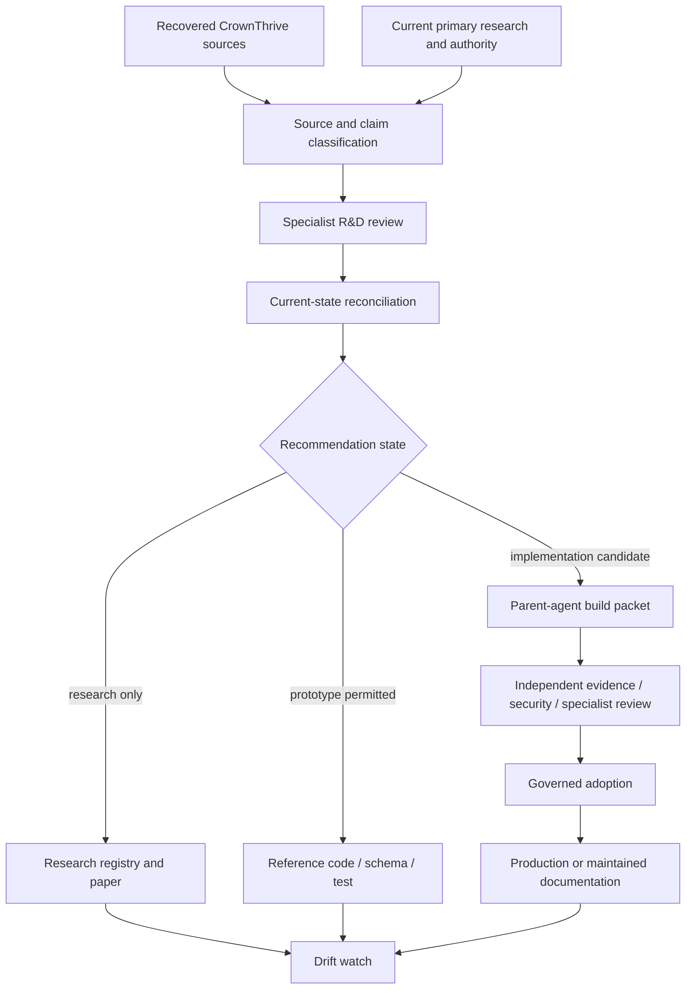

# CHLOM Specialist R&D Integration and Paper Pipeline

CHLOM research is not a side library. It is a continuously reconciled input into architecture, policy, rights, economics, interfaces, tests, papers, and implementation. This pipeline connects the six [Specialist R&D Subagents](/automation/chlom-specialist-rd-fabric) to the existing [Paper-to-Engineering Decomposition Pipeline](/chlom/paper-to-engineering-decomposition-pipeline) without treating recovered historical design as current production authority.

## Table of contents

- [Recovered design baseline](#recovered-design-baseline)
- [R&D-to-engineering graph](#rd-to-engineering-graph)
- [Metaprotocol rebuild lanes](#metaprotocol-rebuild-lanes)
- [Research object model](#research-object-model)
- [Paper lifecycle](#paper-lifecycle)
- [Code and protocol artifacts](#code-and-protocol-artifacts)
- [Cross-specialist review matrix](#cross-specialist-review-matrix)
- [Human and machine projections](#human-and-machine-projections)
- [Current phase boundary](#current-phase-boundary)

## Recovered design baseline

Recovered CrownThrive sources include substantial CHLOM metaprotocol and decentralized-compliance design material. Those sources describe concepts such as DLA, LEX, blockchain/runtime infrastructure, decentralized identity, verifiable credentials, zero-knowledge proofs, AI-assisted compliance, smart treasury, smart contracts, and token/economic concepts.

They are **design-history inputs**. The rebuild process must independently determine for each proposition:

- whether the original proposition is still technically sound;
- whether current law/regulation changes its applicability;
- whether the rights/IP are clear;
- whether the economic model is viable and supportable;
- whether the cryptography remains current and migration-ready;
- whether the user/customer experience is accessible and fair;
- whether the design works across intended regions and data-transfer boundaries;
- whether the component exists now, is prototype-only, or remains target architecture.

This prevents two failure modes: losing CrownThrive's recovered intellectual history, and blindly reviving historical claims as if nothing changed.

## R&D-to-engineering graph



The graph is intentionally cyclic. New regulation, standards, cryptography, provider behavior, vulnerabilities, platform state, or CrownThrive decisions can reopen earlier conclusions.

## Metaprotocol rebuild lanes

### Policy and compliance rail

Legal/Regulatory R&D maps obligations to machine-readable policy requirements. Agent C and CHLOM policy cells may then build deterministic decision contracts, policy bundles, jurisdiction selectors, evidence hooks, and hold/review behavior. AI may assist research, classification, and anomaly detection, but binding authority comes from verified policy sources and adopted CrownThrive controls.

### Rights and licensing rail

IP/Rights/Licensing R&D decomposes DLA/rights concepts into stable rights objects, chain of title, grant scope, term, territory, medium, exclusivity, sublicensing, revocation, royalty, evidence, and approval requirements. On-chain representation, if ever used, is a projection of governed rights state, not the source of a right that was never granted.

### Finance and treasury rail

Finance/Tax/Treasury R&D defines payment, settlement, ledger, reconciliation, fee, tax-data, reserve, refund/dispute, treasury, and audit-event requirements. Future token or digital-asset economics must remain separate from ordinary fiat/commercial accounting and must not be activated merely because a protocol paper models them.

### Cryptographic and protocol rail

Blockchain/Cryptographic Protocol R&D owns comparison and prototypes across chain/runtime choices, EVM/Solidity interoperability, signatures, hashes, attestations, DIDs/VCs, ZK proofs, key custody boundaries, data availability, oracle design, bridges, formal verification, crypto agility, and post-quantum migration.

Design preference is **protocol modularity over permanent vendor or chain dependence**. CHLOM stable contracts should remain portable enough to move between execution backends when security, regulation, cost, ecosystem maturity, or cryptographic requirements change.

### Accessibility and consumer rail

Accessibility/Consumer Protection R&D maps protocol and policy decisions into actual experiences: readable disclosures, keyboard and screen-reader compatible workflows, understandable consent and authorization, accessible authentication, transparent fees and offers, accessible support, usable error states, and non-coercive customer choices.

### Regional and localization rail

Regional/Global Localization R&D attaches jurisdiction, language, currency, time zone, market availability, sanctions/restriction, data-transfer, translation, support, tax-display, rights-territory, and regional-search dimensions to otherwise global system objects.

## Research object model

A specialist research object should be addressable independently from the page or paper that explains it:

```json
{
  "id": "ct.research.blockchain.crypto-agility",
  "schema_version": "1.0.0",
  "domain": "blockchain_cryptographic_protocol",
  "state": "research_only",
  "as_of": "2026-08-19",
  "question": "How should CHLOM preserve cryptographic portability?",
  "source_refs": [],
  "recovered_source_refs": [],
  "claims": [],
  "current_state_refs": [],
  "recommendation": {
    "summary": "Prefer algorithm/provider abstraction and explicit migration inventory.",
    "implementation_state": "proposed",
    "alternatives": []
  },
  "risks": [],
  "affected_component_ids": [],
  "affected_platform_ids": [],
  "approvals_required": [],
  "paper_refs": [],
  "code_refs": [],
  "reopen_triggers": []
}
```

The record may later point to an accepted ADR, implementation, evaluation result, or correction. The original research state remains historically recoverable.

## Paper lifecycle

The [CHLOM Paper Suite and IP Library](/chlom/paper-suite-and-ip-library) remains the family registry. Specialist papers use this lifecycle:

```text
research_question
-> source_set_locked_for_version
-> claims_classified
-> current_state_reconciled
-> architecture_or_analysis_drafted
-> specialist_cross_review
-> machine_companion_generated
-> publication_review
-> published_research
-> adopted / superseded / archived / still_research_only
```

Paper color/family does not itself create authority. Each paper records its authority state.

### Paper minimum package

A substantive technical or institutional paper should include:

- executive abstract for broad readers;
- machine abstract/metadata;
- audience and intended decision;
- source/provenance register;
- recovered-history section when relevant;
- current research/authority section;
- architecture or analytical model;
- implementation decomposition;
- risks, threat model, legal/rights/financial implications;
- accessibility and regional/global implications where relevant;
- alternatives and rejected options;
- diagrams/tables/code where useful;
- test/evaluation requirements;
- open questions and approval needs;
- related CHLOM components, APIs, MCP tools, papers, and pages;
- version, as-of date, correction/supersession behavior.

## Code and protocol artifacts

The Blockchain/Cryptographic specialist may prepare code to convert research into falsifiable engineering artifacts. Appropriate research outputs include:

- JSON Schema / OpenAPI / MCP schemas;
- policy fixtures;
- Solidity contracts in isolated test/prototype form;
- Rust/runtime prototypes;
- signature and hash test vectors;
- ZK circuit/interface experiments;
- DID/verifiable-credential data models;
- economic simulation fixtures;
- formal invariants;
- fuzz/property tests;
- interoperability harnesses;
- threat models and attack simulations.

Every artifact carries a state label such as `example`, `prototype`, `test_fixture`, `candidate`, or `production`. A code block in a paper is never production evidence by itself.

### Solidity / smart-contract minimum safety contract

Before any smart contract can move beyond isolated prototype status, its packet must define at least:

- ownership/admin model;
- upgradeability decision and risks;
- pause/emergency behavior;
- authorization model;
- reentrancy and external-call assumptions;
- arithmetic/value invariants;
- oracle/trust dependencies;
- signature/replay/domain-separation behavior;
- chain/finality assumptions;
- test/fuzz/static-analysis coverage;
- deployment/verification path;
- key custody and recovery;
- economic attack analysis;
- legal/rights/finance applicability;
- rollback or migration strategy.

## Cross-specialist review matrix

| Change | Minimum specialist perspectives before adoption |
| --- | --- |
| public terms/disclosure | Legal + Consumer; IP if rights language changes |
| license/rights object | IP + Legal; Finance if royalties/consideration exist |
| payment/settlement rail | Finance + Security; Legal/Consumer as applicable |
| tokenized right or asset | Blockchain + Legal + Finance + IP + Security + Regional |
| DID/credential proof | Blockchain + Security/Privacy + Legal + Accessibility + Regional |
| international launch | Regional + Legal + Finance + Accessibility/Consumer + Security |
| public AI feature | Legal + IP + Accessibility/Consumer + Regional + AI/ML TEVV + Security |
| smart contract | Blockchain + Security + Legal + Finance; IP/Regional where applicable |

This is an applicability matrix, not a fixed voting quorum. The canonical governance system determines actual approval requirements from the exact diff and risk.

## Human and machine projections

One governed knowledge object may produce:

- a public explanation;
- a developer reference;
- an operator runbook;
- a founder decision packet;
- a specialist research paper;
- a machine JSON/YAML record;
- an MCP retrieval object;
- an evaluation fixture;
- a changelog/correction entry.

All projections preserve the same stable IDs and state boundaries. Public-safe projections omit restricted implementation detail while retaining enough provenance to show why a claim is supported.

## Current phase boundary

This specialist pipeline can be built and exercised during Phase 2.99 because research ingestion, machine contracts, documentation, isolated prototypes, and reversible validation strengthen the hard-exit evidence base. It does **not** authorize Phase 3 entry or future Phase-9 token/blockchain deployment.

The immediate CHLOM build priority is to use recovered sources plus current authoritative research to produce decomposed requirements, tests, schemas, risk records, and implementation packets that can survive later technology changes.

## Related pages

- [CHLOM Specialist R&D Subagent Fabric](/automation/chlom-specialist-rd-fabric)
- [Documentation Linking and Machine-Ingestion Standard](/standards/documentation-linking-and-machine-ingestion)
- [CHLOM Paper Suite and IP Library](/chlom/paper-suite-and-ip-library)
- [Paper-to-Engineering Decomposition Pipeline](/chlom/paper-to-engineering-decomposition-pipeline)
- [MCP/API Governance](/standards/mcp-api-governance)
- [AI/ML/LLM Lifecycle and Evaluation](/standards/ai-ml-llm-lifecycle-and-evaluation)
