# Payment and fulfillment

CrownThrive first-party digital commerce follows a verified-entitlement model. The diagram below describes direct Stripe checkout where that profile is enabled; Virality Music uses the credit-only profile documented below.

```mermaid
flowchart LR
    P[Approved product] --> S[Server creates Checkout Session]
    S --> C[Customer completes Stripe Checkout]
    C --> W[Signed webhook received]
    W --> V[Payment and product mapping verified]
    V --> E[Entitlement created]
    E --> T[Short-lived download token]
    T --> D[Protected delivery]
    D --> A[Audit, support, refund, and dispute state]
```

## Virality Music credit-only profile

Virality Music catalog purchases accept Virality Credits only. Stripe funds credit topups but does not directly authorize catalog fulfillment.

A catalog redemption must resolve the approved SKU and credit price, atomically debit the internal ledger, create the order and entitlement, and preserve reversal evidence. A refund restores or locks the applicable credit buckets and revokes access according to policy.

Private custody and active delivery are separate controls. Google Drive masters must remain private and cannot become storefront delivery objects until exact parity, server-side identity, entitlement, and readback gates pass.

## Source of truth

For direct Stripe commerce, the signed payment webhook is authoritative for payment state. For Virality Music topups, the signed webhook is authoritative only for credit funding; the atomic ledger debit and server-created order and entitlement authorize catalog fulfillment.

The following are not sufficient proof of payment:

- reaching a success page
- a client-side payment callback
- a screenshot
- a browser-supplied amount
- a browser-supplied product or Price ID
- an email stating that payment succeeded

## Checkout creation

The browser submits only an approved product identifier or SKU.

The server resolves:

- product
- active version
- approved tender mapping: credit price, or Stripe Product and Price for direct-payment profiles
- amount, currency, or credit quantity as applicable
- rights class
- delivery method
- download allowance
- success and cancellation routes

Sensitive file paths and secrets do not enter public metadata.

## Webhook requirements

Webhook processing must be:

- signature verified
- based on the raw request body where required
- idempotent
- retry safe
- rate controlled
- observable
- minimally logged
- reconciled to the canonical product registry

Typical event families include:

- completed checkout
- delayed payment success or failure
- session expiration
- refunds
- disputes
- subscription state changes where applicable

## Entitlements

A digital entitlement should identify:

- entitlement ID
- product and version
- customer or purchaser reference
- order and payment references
- payment state
- purchase timestamp
- rights class
- delivery status
- maximum downloads
- download count
- last access
- refund or dispute state
- revocation or suspension reason

Repurchase creates a new entitlement when a new eligible payment succeeds.

## Protected delivery

Premium files should not use predictable permanent public URLs.

A protected delivery request should verify:

1. entitlement exists
2. entitlement belongs to the requesting account or approved access context
3. entitlement state permits access
4. product and version match
5. download allowance remains
6. token is valid and unexpired
7. requested asset is the approved fulfillment asset

The delivery service records the attempt and updates the entitlement according to policy.

## Refunds and disputes

A refund or dispute changes entitlement state according to the governing policy.

Recommended states:

- `ACTIVE`
- `SUSPENDED`
- `REFUNDED`
- `DISPUTED`
- `REVOKED`
- `FAILED`

The audit history remains even when access is revoked.

## Subscription fulfillment

Subscription entitlements follow the current billing state, including:

- active
- trialing
- past due
- grace period
- paused where supported
- canceled
- expired

A canceled subscription may retain access through the paid-through date when policy permits.

## Credits redemption

Credits change the tender, not the product and entitlement model.

A credits redemption should still produce:

- an order
- product and version mapping
- a ledger transaction
- entitlement
- delivery record
- reversal behavior
- support and audit trail

## Reconciliation

Scheduled or operator-driven reconciliation should compare:

- Stripe payment state
- Stripe topup state and internal credit posting
- credit debits or reversals and their corresponding orders and entitlements
- CrownThrive order state
- entitlement state
- fulfillment state
- refund/dispute state
- public product state

Any mismatch becomes a tracked reconciliation incident.

## Customer-facing transparency

Product and policy pages should explain:

- immediate electronic delivery when applicable
- personal-use boundaries
- download allowance and link expiration where used
- refund and defective-file exceptions
- how disputes affect access
- support route
- where to obtain broader commercial rights

<Warning>
  Never expose payment secrets, webhook secrets, permanent private-asset URLs, complete payment payloads, or raw entitlement tables in public pages, client bundles, or analytics tools.
</Warning>