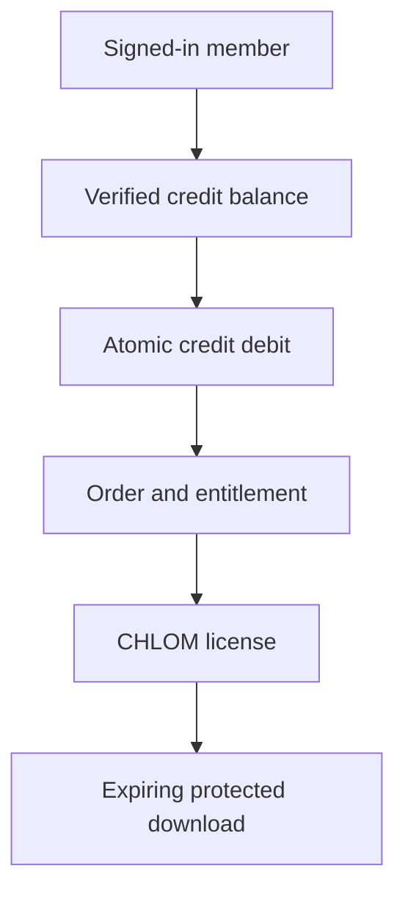

# Commerce rails

CrownThrive separates tender, payment confirmation, entitlement, license, and delivery. A successful redirect or a product card is never proof of payment, authority, or access.

## Virality first-party digital products

Virality Credits are the sole customer tender for eligible first-party digital products.

The catalog and server select the fixed credit price. The browser cannot submit a USD price, grant an entitlement, or select a different rail.

Required controls:

- server-side SKU, version, and fixed-credit mapping;
- append-only purchased and promotional credit ledgers;
- atomic debit and wallet-limit enforcement;
- idempotent order and entitlement creation;
- active member and license checks;
- immutable artifact fingerprints;
- expiring, limited-use delivery tokens;
- refund, dispute, and revocation reconciliation.

## Credit top-ups and Stripe

Stripe is retained only as the hosted payment and signed event-confirmation provider for approved credit top-ups, subscriptions, and persisted legacy transactions. It is not the product checkout rail for the Virality digital catalog.

A top-up is staged locally before redirect. Credits post only after a verified, idempotent webhook matches the pending intent, expected amount, currency, environment, and integration identifier. Refunds and disputes reconcile the wallet and may lock future credit availability.

Do not remove signed webhook verification. Removing it would make payment confirmation, refunds, and chargebacks untrustworthy.

## CHLOM licensing

CHLOM is the sole active authority for license state, permission, evidence, fingerprints, holds, and remedies.

A purchase may create personal access only when:

1. the product version and artifact fingerprint are immutable;
2. the member and entitlement are active;
3. CHLOM-compatible license issuance succeeds;
4. the delivery token is bound to the entitlement and file.

Commercial, institutional, performance, adaptation, source-file, character, voice, training, or derivative permissions require an approved CHLOM rights workflow or signed agreement. Payment never expands scope by itself.

Good Shit Only may remain in historical records and marketplace provenance. It is not the active Virality licensing authority.

## Private file custody and delivery

Google Drive is the private canonical custody layer for source masters and governed release candidates. Files must remain unshared.

Runtime delivery uses a private, integrity-checked delivery cache until a production server-side Drive delivery identity and equivalent audit controls are verified. Public Drive links are prohibited. Every delivered object must match the registered SHA-256 digest and byte count.

## Other rails

- **Subscriptions:** Stripe Billing or another approved recurring system, governed by signed state changes.
- **Third-party creators:** an approved marketplace/Connect architecture with explicit seller, tax, payout, refund, and dispute ownership. Internal credits must not fund third-party connected-account products.
- **Services and partnerships:** signed scopes, invoices, milestones, or controlled checkout for bounded offers.
- **Hosted readers:** a verified reader rail, separate from download, source ownership, and rights status.

## Release and handoff rules

1. The registry selects the rail; the client does not.
2. Tender, payment, order, entitlement, license, and delivery are separate records.
3. A listing stays fail-closed until every required dependency and canary is verified.
4. Refunds, disputes, suspension, or license revocation update access without erasing evidence.
5. Google Drive custody does not imply public delivery.
6. Cross-rail changes require versioned mappings, regression tests, and audit evidence.

<Warning>
  Never use a personal-access product, a credit balance, or a successful payment to imply broader commercial or institutional rights.
</Warning>
