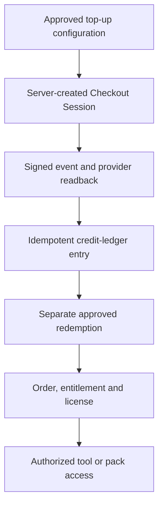

# Monetizable tooling coordination and release gate

CrownThrive may develop reusable MCP tools and capability packs from its governed documentation, CHLOM, platform, evidence and AI/ML operating systems. This page starts that work at the **architecture and specification level only**.

The public machine companion is `developers/manifests/monetizable-tooling-coordination.v1.json`. It assigns stable candidate IDs and encodes the same fail-closed commerce state; it is not a Product, Price, offer catalog or entitlement registry.

<Warning>
  **Current commerce state: `GOVERNED_HOLD`.** Every tool family below is a candidate. This specification does not create or activate an offer, price, Stripe Product, Checkout Session, Customer, webhook endpoint, subscription, payment link, credit top-up, order, entitlement or license.
</Warning>

## Bounded development posture

| Control | Current rule |
| --- | --- |
| Development authority | `A1_prepare` — architecture, manifests, schemas, synthetic fixtures and review packets only |
| Commercial model | Credits-only candidate delivery for eligible first-party CrownThrive capabilities |
| Candidate credit floor | 400 credits minimum; a floor is not an active price or offer |
| Stripe state | `GOVERNED_HOLD` |
| Customer access | No access until an exact approved redemption creates an entitlement and accepted license record |
| Public-claim boundary | Candidate, proposed and test states must never be presented as live, purchasable, certified or customer-proven |

Candidate top-up amounts, legacy provider objects or historical metadata may exist elsewhere. Their existence does not prove that a current top-up, price, Checkout mapping, tax configuration or funding path is approved.

## Candidate tool families

The following names describe bounded capability candidates, not products or production tools.

| Stable candidate ID | Candidate purpose | Required output boundary |
| --- | --- | --- |
| `ct.tool.docs-drift-auditor` | Compare governed sources, navigation, claims, changelogs and public projections for stale or missing propagation | Findings and a proposed delta; no autonomous merge or public-claim promotion |
| `ct.tool.platform-placement-reconciler` | Map platforms, brands, aliases, predecessors, successors and corridors without collapsing identities | Typed placement and collision report with unresolved records held |
| `ct.tool.rights-provenance-preflight` | Check whether required source, contributor, AI/provider, license and chain-of-title fields are present | Readiness recommendation only; no ownership determination or license grant |
| `ct.tool.chlom-policy-evaluator` | Evaluate an explicit action against versioned Rights, Rules, Roles, Revenue, Records and Remedies inputs | Permit, deny, hold or review-required recommendation with reason codes; consequential authority remains external |
| `ct.tool.evidence-packet-assembler` | Assemble source references, hashes, versions, test receipts and review requirements for a governed decision | Minimum-necessary packet or protected references; no unrestricted evidence disclosure |
| `ct.tool.ai-evaluation-report` | Summarize TEVV results for a declared model, prompt, retrieval profile, dataset and tool version | Evaluation report with failures, uncertainty and human-review requirements; no certification claim |

Each candidate receives a stable tool ID, owner, MCP contract version, purpose, input/output schema, data classes, autonomy class, side-effect declaration, cost/credit budget, evaluation suite, approval policy, observability fields, failure behavior and retirement path before implementation.

## Protected capability boundary

Public documentation may describe the candidate's purpose, allowed inputs, response contract, release state and evidence standard. Proprietary algorithms, policy weights, prompts, restricted evaluation sets, exploit-enabling controls, vault locations, secret references, customer records and protected evidence bodies remain in the appropriate restricted or strategic system.

An integrity hash or CHLOM fingerprint may prove that an exact representation was recorded. It does not by itself prove ownership, truth, legal sufficiency, accessibility conformance, tax readiness, customer authorization or commercial release.

## Credits-only commerce target

Credits change the tender; they do not weaken the product, rights, order, entitlement, license, support or audit requirements in [Commerce Rails](/commerce/rails) and [Payment and Fulfillment](/commerce/payment-and-fulfillment).

The target Stripe contract requires:

- server-created Checkout Sessions using eligible dynamic payment methods;
- an allowlisted `integration_identifier` resolved server-side to the exact CrownThrive integration and never trusted as browser authority;
- a least-privilege restricted API key held only through approved secret custody, with separate test and live references;
- raw-body webhook signature verification, provider object readback, event allowlisting and secret rotation;
- idempotency for Checkout creation, provider-event receipts, credit entries, redemption and entitlement mutations;
- one append-only path from verified webhook evidence to the Crown Credits ledger, followed by a separate atomic redemption into the order and entitlement ledger;
- explicit product tax classification, customer-jurisdiction handling and active tax-registration evidence before any automated tax or live funding activation;
- compensating entries for refunds, partial refunds, disputes and reversals, with proportional entitlement suspension or revocation under the governing policy;
- reconciliation among provider payment state, credit ledger, order, entitlement, license, access and support records.

A success redirect, candidate top-up, provider object, wallet balance or manual database row cannot create credits, an order, a license or access.

## Release gates

A candidate remains on `GOVERNED_HOLD` until all applicable gates pass for the exact version and environment.

1. **Identity and lineage:** stable tool, pack, source and successor IDs exist; open collision and lineage dependencies in [PR #133](https://github.com/crownthrive1/CrownThrive-Support/pull/133), [PR #180](https://github.com/crownthrive1/CrownThrive-Support/pull/180) and [PR #189](https://github.com/crownthrive1/CrownThrive-Support/pull/189) are merged, superseded or explicitly held without silent identity promotion.
2. **Builder controls:** contributor authority, confidentiality/IP terms, repository scopes, synthetic data, review and acceptance follow the [Developer, Builder and Contribution Program](/developers/builder-program).
3. **MCP contract:** the target `2026-07-28` profile, tool schemas, authentication, scopes, rate/cost limits, data class, side effects, approval and rollback behavior are versioned and tested.
4. **TEVV:** AI/ML/LLM use-case, provider/model/prompt/retrieval/data lineage, source fidelity, prompt-injection, privacy, bias, cultural alignment, structured-output, cost, drift and hold behavior pass the applicable evaluation suite.
5. **Rights and provenance:** source authority, human contribution, third-party dependencies, license scope, redistribution restrictions, trademark/brand use and chain of title support the exact capability and customer use.
6. **Security and privacy:** least privilege, tenant and purpose isolation, secret custody, minimum field return, protected logging, retention, deletion, incident pause, backup and vendor exit are verified.
7. **Accessibility and consumer protection:** the interface, documentation and every delivered format have exact-version accessibility evidence, understandable limitations, support, correction and refund behavior. Accessibility targets are not represented as certification without evidence.
8. **Economics and tax:** the exact credit schedule, effective window, eligible jurisdiction, terms, refund policy, product tax code and required active registrations are independently approved. The 400-credit floor cannot activate a price by itself.
9. **Commerce certification:** test-mode Checkout, dynamic payment methods, `integration_identifier`, restricted-key custody, signed webhooks, duplicate/replay, asynchronous payment, refund, dispute, reversal, entitlement revocation, reconciliation and rollback canaries pass.
10. **Independent release decision:** the producer does not certify its own work. Required specialist review and the named human or governance authority approve the exact offer, release, environment and rollback packet before any live activation.

## Activation and failure rules

Activation must be incremental: one exact tool or pack, one exact credit schedule, one exact license, one tested environment and one recorded approval packet. Expansion follows observed evidence rather than copying a passing result to unrelated candidates.

On missing authority, collision, rights, tax registration, signature, idempotency, TEVV, privacy, accessibility, entitlement, support or rollback evidence, the safe result is `HOLD`, read-only degradation or correction. Automation may retry an idempotent operation; it may not alter rights, money destinations, prices, evidence or customer state to make a failure disappear.

## What this page establishes

This page establishes a public-safe coordination contract for preparing monetizable tooling. It does not establish a live marketplace, active customer base, approved price, current Stripe configuration, deployed MCP server, external certification, revenue, purchase, entitlement or successful fulfillment.
