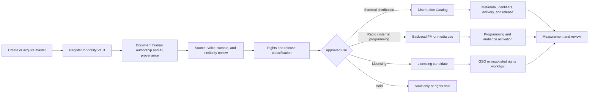

# Music release workflow

Virality Music does not treat generation volume as a release strategy. Assets enter the Virality Vault first and move into external distribution only after deliberate selection and governance.

## Step 1 — Register the asset

Create a canonical asset record containing:

- asset ID
- title and version
- project, universe, character, album, or playlist relationships
- source file and checksum
- creator and contributors
- creation date
- source type
- intended uses
- initial rights state

## Step 2 — Human-authorship and AI-provenance record

Record the human contribution:

- lyrics
- concept and story-world direction
- composition and arrangement
- structure and sequencing
- performance
- editing and stem work
- production and mastering
- selection, rejection, and revision
- visual and release direction

Record AI or software assistance:

- tool and model
- account tier at creation
- generation date
- uploaded sources
- synthetic voice or generated performance
- source output and version
- known tool restrictions

## Step 3 — Source, voice, sample, and similarity review

Review:

- uploaded or referenced materials
- lyrics and composition similarity
- samples and interpolations
- synthetic voice and consent
- likeness and character implications
- third-party recordings
- confidential or protected source content

A tool-generated screening result is evidence, not final clearance.

## Step 4 — Rights and release classification

Assign:

- master ownership
- composition ownership
- contributor shares
- copyright-claim status
- PRO and publishing status
- commercial restrictions
- distribution eligibility
- licensing eligibility
- remix, sample, stem, voice, training, and adaptation permissions

## Step 5 — Distribution decision

Choose one or more governed uses:

### Distribution Catalog

For recordings deliberately selected for external commercial release.

### Backroad FM and internal programming

For approved broadcast, audience testing, premieres, soundtrack use, and story-world activation.

### Licensing candidate

For sync, podcast, game, advertising, institutional, brand, or other governed use.

### Vault only

For developmental, archival, alternate, internal, incomplete, or strategically withheld assets.

## Step 6 — Metadata and delivery

For external distribution, prepare:

- canonical title
- artist and contributor display
- version label
- explicit status
- genre and language
- artwork
- identifiers
- release date
- lyrics and credits where approved
- AI disclosure where required
- territory and platform restrictions
- distributor package

## Step 7 — Release approval

Approval evidence includes:

- source and version
- rights and provenance record
- similarity and sample review
- metadata and artwork
- distribution class
- platform-policy review
- release and rollback plan

## Step 8 — Activation

Coordinate approved channels:

- external DSP distribution
- Backroad FM programming
- Virality Music world, album, or track pages
- Melanated media or CrownThrive Studios assets
- direct products or companion publishing
- GSO licensing inventory
- search, playlists, and related content

## Step 9 — Measurement

Track:

- plays and completion
- saves, comments, reposts, or other available signals
- Backroad FM response
- world and book engagement
- licensing inquiries
- conversion to direct products
- platform warnings or policy actions
- rights or attribution issues

## Step 10 — Review

Decide whether to:

- expand distribution
- create alternate, clean, instrumental, or stem versions
- package into a world or product
- prioritize licensing
- hold or remove
- correct metadata
- archive

## Prohibited shortcuts

Do not:

- export and distribute thousands merely because they exist
- assume a paid tool account proves full copyright or chain of title
- release synthetic voices without consent
- expose source stems through personal-use commerce
- label every vault asset commercially cleared
- defeat or obscure provenance systems

<Info>
  The objective is not “more uploads.” The objective is a governed catalog of cultural assets that can move through music, radio, books, screen, licensing, direct commerce, and adaptation.
</Info>